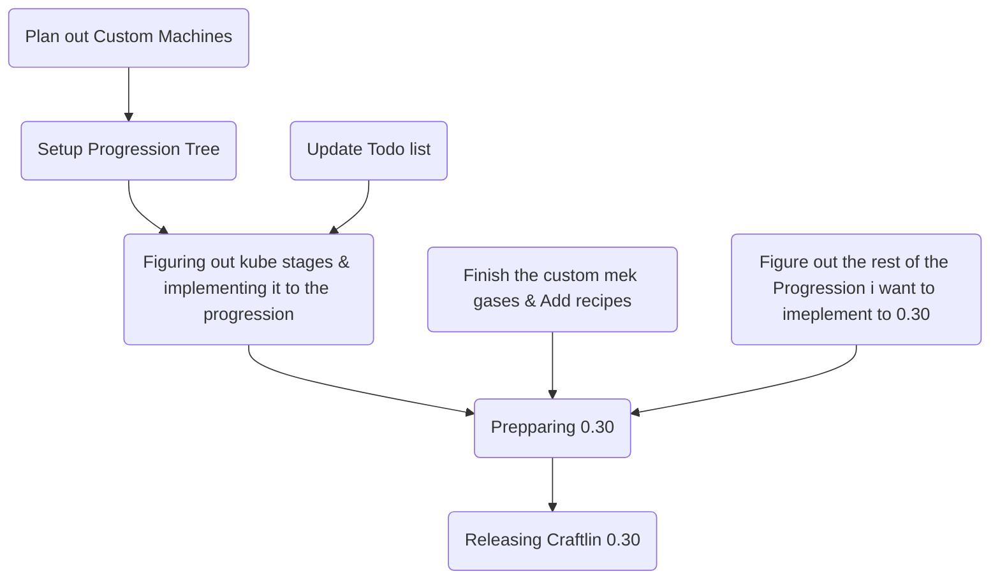

     
 

* * *

* * *

Welcome to Project: Craftlin! This is a heavy technology focused modpack (barely any magic!) The goal of the modpack is too 100% the questbook, and make the creative tab icon.

# $$\text{\color{orange}{Features}}$$

*   A extensive Questbook (coming soonish)
*   Custom Void Miner
*   Native Applied Energistics 2 Dark mode (If you do not like this remove the `ae2/megacells/advancedae/ae2importexportcard/extendedae/appflux/merequester` folders in `/kubejs/assets`)
*   Custom Mystical Agriculture Seeds
*   Buffed AdvancedAE Quantum Computers
*   Soon to have tons of custom machines & Multiblocks to spice up the endgame

# $$\text{\color{orange}{Credits}}$$

I must give Credits where its due:

*   GT: New Horizons &amp; Twist Space Technology (TST for the miracle top, GT:NH for the casing.
*   Draconic Evolution (For the Cores & Dragon Heart texture)

* * *

## Roadmap

